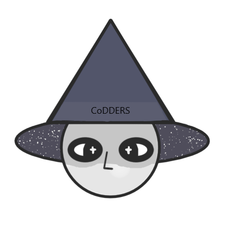

<h1 align="center" >CoDDERS</h1>
 

    

 

## Topic
This console application is used to make a personal will based on the Bulgarian Legislation Laws.

## How to run the console application
<ol>
    <li> Download the latest release </li>
    <li> Run the .exe file </li>
</ol>

## Used technologies

-  C++  
-  Visual Studio Code  
-  Microsoft Word  
-  Microsoft PowerPoint  
-  Microsoft Teams  
-  GitHub  

## Features
✅ Simplistic looking interface.  
✅ 2)  
✅ 3)  

## Our Team
- <a href="https://github.com/EGGeorgieva21"> Emma Georgieva (Scrum Trainer)</a>  

- <a href="https://github.com/KNKostadinov21"> Kristiyan Kostadinov (Backend developer) </a>  
   
- <a href="https://github.com/SAToptunov"> Sergey Toptunov (Backend developer) </a>  
   
- <a href="https://github.com/vbpendashev21"> Valentin Pendashev (Designer) </a>  
  

  
